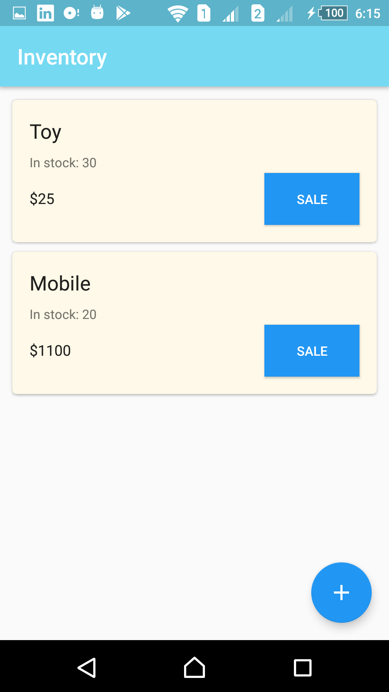
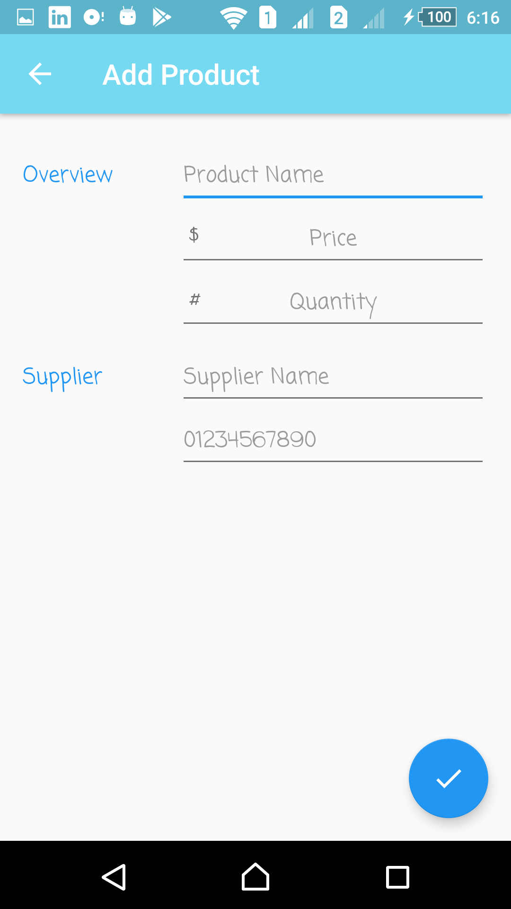
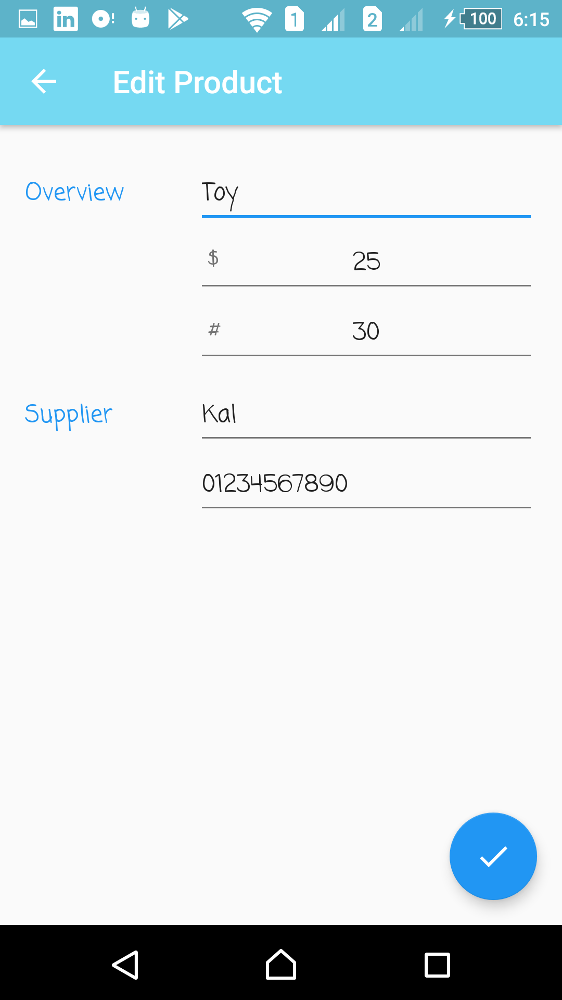
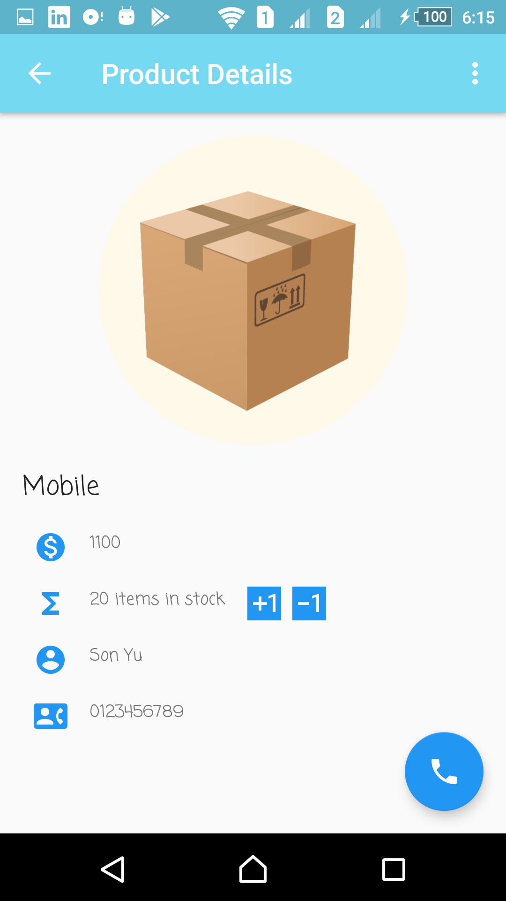
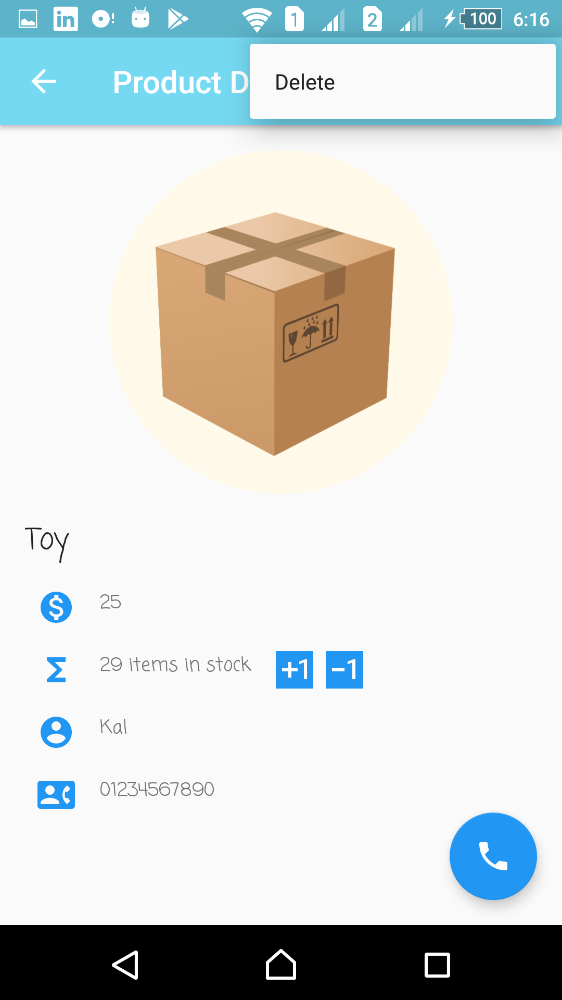
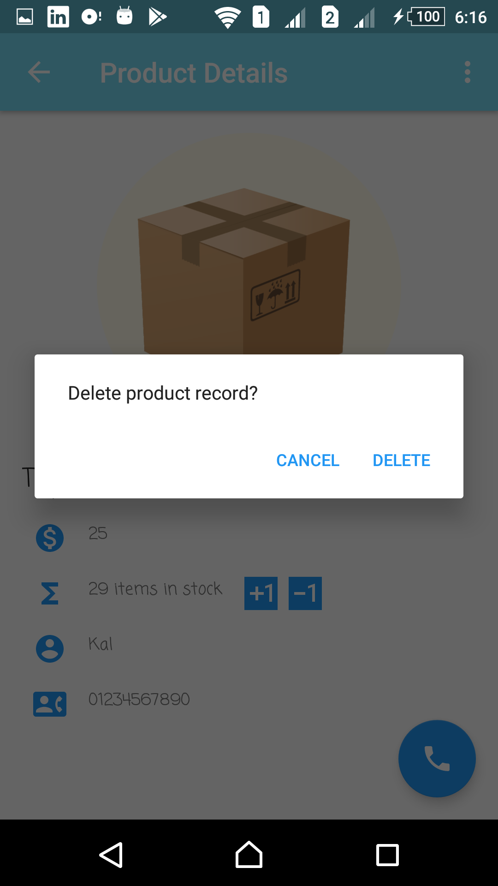

# ABND-Proj7-Inventory-App

The seventh and final project in the Android Basics nanodegree by Google and Udacity: "**Inventory App**".
It consists of the first and the second stages of the Inventory App project in the fifth and last course of the nanodegree "Data Storage".

***

  

  

***

## Udacity's Project Overview:

#### First Stage:

You're almost at the finish line! This project is the first part of a 2 stage project where you'll create a single amazing app that will pull together many of the components you've learned in this Nanodegree program!

In this project, you'll design and create the structure of a Inventory App that will allow a store to keep track of its inventory of products. The app will need to store information about the product and allow the user to track sales and shipments and make it easy for the user to order more from the listed supplier.

In this stage you’ll focus on what happens behind the scenes, practicing how to design and implement a simple database.

[Project Stage 1 Rubric](https://review.udacity.com/#!/projects/345/view)

#### Second Stage:

You've made it to the end! This is the final part of project where you'll create a single amazing app that will pull together many of the components you've learned in this Nanodegree program!

The goal is to design and create the structure of an Inventory App which would allow a store to keep track of its inventory. In Stage 1, you designed and implemented the backend database that stores information about the products and suppliers. In this stage, you'll build out the app UI for users to add and remove inventory. 

[Project Stage 2 Rubric](https://review.udacity.com/#!/projects/346/view)

***

## App Overview:

This is the final project of the Android Basics Nanodegree. It is an application on almost all of the concepts and stuff I have learnt through the nanodegree. Its idea was to add a local SQLite database, design, create it, and do some queries on it, and then using a ContentProvider in the second stage, and adding the UI of the app

The app represents an inventory of a store or something similar. The main activity shows all of the products/ items available in the store, with its quantity, per item price, and the option to sell one item from each.
Also, there is a FloatingActionButton at the buttom that allows to switch to another activity, where the user would be able to add another item to the store.

There is also an option to edit the products already in the store. The user may long click on the required item, which will take him to the activity where he would be able to edit the details of the product including its name, price, quantity, and supplier data, or even remove it from the database.

Through a simple click on the product in the list, the app would switch to the product detail activity, which has information on the whole product, and its supplier, with an option to directly call the supplier either by clicking on his phone number or by clicking on the FloatingActionButton with the phone icon at the buttom.

***

## Android Features:

1. SQLiteDatabase
2. OpenDbHelper
3. Contract and Entry classes
4. ContentProvider
5. Cursors, CursorAdapter, and CursorLoader
6. LoaderManager and LoaderCallbacks

## External Libraries:

1. ButterKnife (Used for better data binding instead of using traditional findViewById() function)

#### Note:

- App icon was downloaded from the internet and the background was edited by me.

